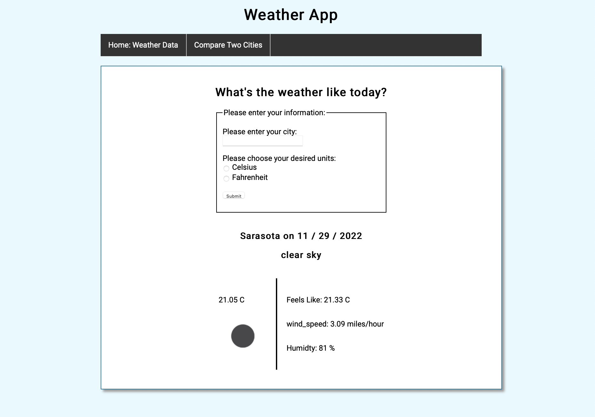

# CLI Weather App

## Info

|       |                                                                                                                                                                                                     |
| ----- | --------------------------------------------------------------------------------------------------------------------------------------------------------------------------------------------------- |
| About | A Weather App built with flask that pulls in real time data to view the climate based on a location of your choice.                                                                                    |
| Team  | [Louisa Goncharenko](https://github.com/lougoncharenko)
| Goal  | Develop a robust application using an API and flask.                                                                                                                  |
|       |                                                                                                                                                                                                     |

## Code Stack

### Core Technologies & Concepts Used

- `Python`:
  - Flask Servers
  - API requests 
  - Virtual Enviroments
- [OpenWeather API](https://openweathermap.org/api)

## Weather App Preview:

## Features:
- Ability to search for weather based on location
- Choose either Celsius or Fahrenheit for temperature
- Compare the weather data of two locations
- Validation if city does not exist

## Improvements
- Adding a three-day, five-day, or seven-day forecast option
- Adding rain predictions (chances of rain)
- Adding a feature that displays time Of Sunrise And Sunset and Humidity And Visibility.
- integrating a weather radar that shows live weather into the terminal